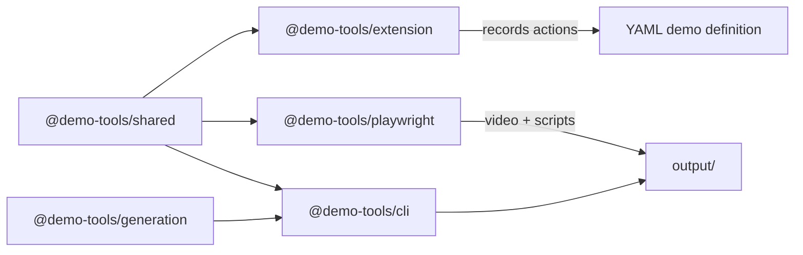
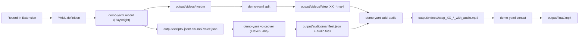

# Demo Tools (demo-yaml-creator)

A monorepo for recording UI interactions to YAML and turning those definitions into narrated demo videos. The system combines a Chrome extension (recording), Playwright (playback + recording), and a CLI pipeline (audio + video post-processing).

## What This Repo Does

- Record user interactions with a Chrome extension and export YAML.
- Replay YAML with Playwright to produce a video plus script metadata.
- Split the recording into per-step clips.
- Generate voiceover audio with ElevenLabs.
- Add audio to each clip and concatenate into a final demo video.

## Architecture

### Package Map



### End-to-End Pipeline



## Requirements

- Bun (workspace + builds)
- Node.js 18+ (CLI runtime)
- FFmpeg (split/add-audio/concat)
- ElevenLabs API key (voiceover generation)

## Setup

```bash
cd demo-yaml-creator
bun install
```

### Voiceover Environment

Create a `.env` file in `demo-yaml-creator/` (copy from `.env.example`) with your ElevenLabs credentials:

```bash
cp .env.example .env
```

You can also point the CLI at a specific env file with `--env-file`.

## Recording Options

### Chrome Extension (authoring YAML)

1. Build and load the extension:
   ```bash
   bun run build
   bun run chrome  # Opens chrome://extensions
   ```
   - Enable "Developer mode" (toggle in top-right)
   - Click "Load unpacked"
   - Select the `dist` folder
2. Navigate to your app and click the extension icon.
3. Click **Record** to capture interactions.
4. Edit steps and export as YAML.

### Playwright (recording a demo run)

The CLI `record` command replays YAML and records video + scripts:

```bash
bunx @demo-tools/cli record \
  --definition examples/create-quote.yaml \
  --base-url http://localhost:5173 \
  --org-slug my-org
```

Common flags:
- `--start-path /app/{orgSlug}` to open a route before running steps
- `--storage-state path/to/user.json` to reuse auth
- `--asset-root path/to/files` for upload resolution
- `--output-dir output` or `--root /path/to/repo`

## YAML Format

```yaml
name: demo-name
title: "Demo Title"
description: |
  Optional description
steps:
  - id: step-id
    script: "Voiceover text for this step"
    actions:
      - action: click
        target:
          type: selector
          selector: "button:has-text('Save')"
        highlight: true
      - action: wait
        waitFor:
          type: text
          value: "Success"
          timeout: 15000
```

Supported `waitFor.type` values:
- `text`
- `selector`
- `navigation`
- `idle`
- `selectorHidden`
- `textHidden`

## Supported Actions

| Action | Parameters | Description |
|--------|-----------|-------------|
| `navigate` | `path` | Go to URL (supports `{orgSlug}` template) |
| `click` | `target`, `highlight?` | Click element |
| `type` | `target`, `text` | Type into input field |
| `upload` | `file`, `target?` | Upload file (auto-finds file input if no target) |
| `wait` | `duration` OR `waitFor` | Wait for time or condition |
| `hover` | `target` | Hover over element |
| `scroll` | `duration` | Scroll page |
| `scrollTo` | `target` | Scroll element into view |
| `drag` | `target`, `drag{deltaX,deltaY,steps}` | Drag element by offset |

## CLI Pipeline

The CLI packages the post-processing pipeline for voiceover, video splits, and final concatenation.

```bash
# Record a demo with Playwright and generate script JSON
bunx @demo-tools/cli record \
  --definition examples/create-quote.yaml \
  --base-url http://localhost:5173 \
  --org-slug my-org

# Run the full pipeline in one command
bunx @demo-tools/cli pipeline \
  --definition examples/create-quote.yaml \
  --base-url http://localhost:5173 \
  --org-slug my-org \
  --clean

# Split, voiceover, add-audio, concat
bunx @demo-tools/cli split --demo create-quote
bunx @demo-tools/cli voiceover --demo create-quote
bunx @demo-tools/cli add-audio --demo create-quote
bunx @demo-tools/cli concat --demo create-quote
```

Notes:
- `split` reads `output/scripts/<demo>.json` and `output/videos/<demo>.webm`.
- `voiceover` uses `ELEVENLABS_API_KEY` and `ELEVENLABS_VOICE_ID`.
- `add-audio` pads or extends clips to align audio with video.
- `concat` re-encodes to avoid audio dropouts at clip boundaries.

By default, the CLI writes to `output/` in the project root (or `e2e/output` if it already exists). You can override with `--root` and `--output-dir`.

## Output Layout

```
output/
├── scripts/
│   ├── <demo>.json
│   ├── <demo>.srt
│   ├── <demo>.md
│   └── <demo>.voice.json
├── videos/
│   ├── <demo>.webm
│   └── <demo>/
│       ├── step_01_<stepId>.mp4
│       ├── step_01_<stepId>_with_audio.mp4
│       └── steps-manifest.json
├── audio/
│   └── <demo>/
│       ├── manifest.json
│       └── segment_*.mp3
└── final/
    └── <demo>.mp4
```

## Programmatic Playback

```typescript
import { chromium } from "@playwright/test";
import { runDemoFromFile } from "@demo-tools/playwright";

const browser = await chromium.launch();
const context = await browser.newContext();
const page = await context.newPage();

await runDemoFromFile("./examples/create-quote.yaml", {
  page,
  baseURL: "http://localhost:5173",
  orgSlug: "my-org",
  outputDir: "./output",
});
```

## Project Structure

```
demo-yaml-creator/
├── packages/
│   ├── shared/                  # Shared types and utilities
│   │   └── src/
│   │       ├── types.ts         # TypeScript interfaces
│   │       ├── yaml-parser.ts   # YAML parsing/serialization
│   │       ├── target-resolver.ts  # Selector resolution
│   │       └── action-helpers.ts   # Action factory functions
│   │
│   ├── playwright/              # Playwright demo runner
│   │   └── src/
│   │       ├── demo-runner.ts   # Main runner
│   │       └── cursor-overlay.ts   # Visual cursor effects
│   │
│   ├── generation/              # Script + audio generation utilities
│   │   └── src/
│   │       ├── script-generator.ts
│   │       └── voice-synthesis.ts
│   │
│   ├── cli/                     # CLI for generation pipeline
│   │   └── src/
│   │       ├── cli.js
│   │       └── commands/
│   │
│   └── extension/               # Chrome extension
│       ├── manifest.json
│       └── src/
│           ├── background/      # Service worker
│           ├── content/         # Content scripts
│           ├── sidepanel/       # React UI
│           └── shared/          # Re-exports from @demo-tools/shared
│
├── examples/                    # Example demo definitions
│   ├── create-quote.yaml
│   └── step-viewer.yaml
│
├── package.json                 # Workspace root
└── tsconfig.json
```

## Development

```bash
# Development mode (watch + rebuild)
bun run dev

# Build all packages
bun run build

# Build just the extension
bun run build:extension

# Type check
bun run typecheck

# Open Chrome extensions page
bun run chrome
```

## Chrome Extension Features

### Recording Mode
- Click **Record** to capture clicks and form inputs
- Actions are grouped into steps with editable voiceover scripts
- Click **Stop** when done

### Element Picker
- Click **Pick Element** to enter visual selection mode
- Hover over elements to see selector preview
- Click to add as a click action
- Press **Esc** to cancel

### Selector Strategies (Priority Order)
1. `data-testid` - Most stable
2. `aria-label` - Accessible and stable
3. `role + text` - e.g., `button:has-text("Save")`
4. `placeholder` - For input fields
5. CSS path with meaningful classes
6. XPath - Last resort fallback

### YAML Preview & Export
- **YAML Preview** tab shows live output
- **Copy** to clipboard or **Download** as file
- **Edit YAML** mode for direct editing with validation

### Playback
- **Play Step** to test individual steps
- **Play All** to run the complete demo
- Requires content script to be active on page

## Troubleshooting

- `FFmpeg is not installed`: install FFmpeg and re-run `split`, `add-audio`, or `concat`.
- `ELEVENLABS_API_KEY environment variable is required`: add it to `demo-yaml-creator/.env` or pass `--env-file`.
- `Uploads fail`: use `--asset-root` or provide absolute file paths.
- `Selectors miss portal content`: prefer portal-scoped selectors (the recorder detects Radix/Headless UI portals).
- `Audio cuts between steps`: re-run `add-audio` (pads silence) and `concat` (re-encodes).

## License

MIT
