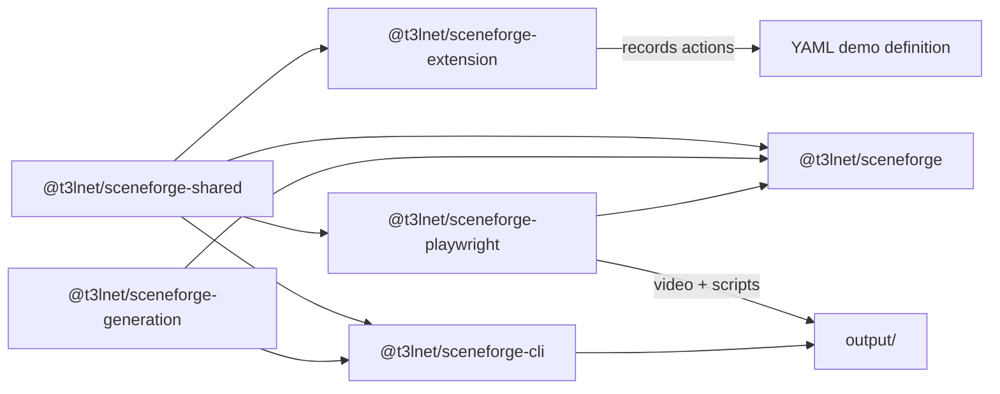
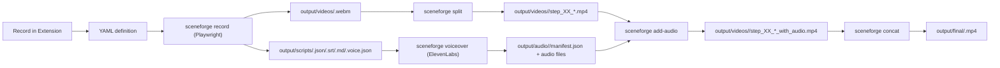

# SceneForge

An open-source monorepo for recording UI interactions to YAML and turning those definitions into narrated demo videos. The system combines a Chrome extension (recording), Playwright (playback + recording), and a CLI pipeline (audio + video post-processing).

## What This Repo Does

- Record user interactions with a Chrome extension and export YAML.
- Replay YAML with Playwright to produce a video plus script metadata.
- Split the recording into per-step clips.
- Generate voiceover audio with ElevenLabs.
- Add audio to each clip and concatenate into a final demo video.

## Architecture

### Package Map



### End-to-End Pipeline



## Requirements

- Bun (workspace + builds)
- Node.js 18+ (CLI runtime)
- FFmpeg (split/add-audio/concat)
- ElevenLabs API key (voiceover generation)

## Install (Library)

```bash
npm i -D @t3lnet/sceneforge @playwright/test
```

## Setup

```bash
cd sceneforge
bun install
```

### Voiceover Environment

Create a `.env` file in `sceneforge/` (copy from `.env.example`) with your ElevenLabs credentials:

```bash
cp .env.example .env
```

You can also point the CLI at a specific env file with `--env-file`.

## Recording Options

### Chrome Extension (authoring YAML)

1. Build and load the extension:
   ```bash
   bun run build
   bun run chrome  # Opens chrome://extensions
   ```
   - Enable "Developer mode" (toggle in top-right)
   - Click "Load unpacked"
   - Select the `dist` folder
2. Navigate to your app and click the extension icon.
3. Click **Record** to capture interactions.
4. Edit steps and export as YAML.

### Playwright (recording a demo run)

The CLI `record` command replays YAML and records video + scripts:

```bash
bunx @t3lnet/sceneforge-cli record \
  --definition examples/create-dxf-quote.yaml \
  --base-url http://localhost:5173
```

Common flags:
- `--start-path /app/quotes` to open a route before running steps
- `--storage-state path/to/user.json` to reuse auth
- `--asset-root path/to/files` for upload resolution
- `--output-dir output` or `--root /path/to/repo`
- `--locale en-US` or `DEMO_LOCALE=en-US` to control request locale (default: `en-US`)

## YAML Format

```yaml
version: 1
name: demo-name
title: "Demo Title"
description: |
  Optional description

# Optional media configuration for final video
media:
  intro:
    file: "assets/intro.mp4"
    fade: true
    fadeDuration: 0.5
  outro:
    file: "assets/outro.mp4"
    fade: true
  backgroundMusic:
    file: "assets/background-music.mp3"
    volume: 0.15
    loop: true
    fadeIn: 1.5
    fadeOut: 2.0
    startAt:
      type: "afterIntro"
    endAt:
      type: "beforeOutro"

steps:
  - id: step-id
    script: "Voiceover text for this step"
    actions:
      - action: click
        target:
          type: selector
          selector: "button:has-text('Save')"
        highlight: true
      - action: wait
        waitFor:
          type: text
          value: "Success"
          timeout: 15000
```

Supported `waitFor.type` values:
- `text`
- `selector`
- `navigation`
- `idle`
- `selectorHidden`
- `textHidden`

`version` defaults to `1` if omitted, but including it is recommended for forward compatibility.

## Secrets in YAML

Use `${SECRET:VAR_NAME}` (or `${ENV:VAR_NAME}`) placeholders to avoid committing credentials:

```yaml
actions:
  - action: type
    target:
      type: selector
      selector: "input[name=\"email\"]"
    text: "${SECRET:NANOQUOTE_USER_EMAIL}"
```

The CLI will load `.env` or `.local/.env` automatically (or use `--env-file`) when running `record`, `setup`, or `pipeline`. Missing secrets will error during parsing.

## Supported Actions

| Action | Parameters | Description |
|--------|-----------|-------------|
| `navigate` | `path` | Go to URL (supports `{baseURL}` template) |
| `click` | `target`, `highlight?` | Click element |
| `type` | `target`, `text` | Type into input field |
| `upload` | `file`, `target?` | Upload file (auto-finds file input if no target) |
| `wait` | `duration` OR `waitFor` | Wait for time or condition |
| `hover` | `target` | Hover over element |
| `scroll` | `duration` | Scroll page |
| `scrollTo` | `target` | Scroll element into view |
| `drag` | `target`, `drag{deltaX,deltaY,steps}` | Drag element by offset |

## CLI Pipeline

The CLI packages the post-processing pipeline for voiceover, video splits, and final concatenation.

### Setup/Login (Storage State)

Run a setup YAML to log in once and save Playwright storage state for later sessions:

```bash
bunx @t3lnet/sceneforge-cli setup \
  --definition examples/setup-login.yaml \
  --base-url http://localhost:5173 \
  --start-path /app \
  --headed \
  --storage-state output/storage/login.json
```

Then reuse the cached session during recording or pipeline runs:

```bash
bunx @t3lnet/sceneforge-cli record \
  --definition examples/create-dxf-quote.yaml \
  --base-url http://localhost:5173 \
  --storage-state output/storage/login.json
```

```bash
# Record a demo with Playwright and generate script JSON
bunx @t3lnet/sceneforge-cli record \
  --definition examples/create-dxf-quote.yaml \
  --base-url http://localhost:5173

# Run the full pipeline in one command
bunx @t3lnet/sceneforge-cli pipeline \
  --definition examples/create-dxf-quote.yaml \
  --base-url http://localhost:5173 \
  --clean

# Preview pipeline steps and skip existing artifacts
bunx @t3lnet/sceneforge-cli pipeline \
  --definition examples/create-dxf-quote.yaml \
  --resume \
  --progress \
  --dry-run

# Split, voiceover, add-audio, concat
# (The sample YAML uses name: "new-demo", so downstream commands use that demo name.)
bunx @t3lnet/sceneforge-cli split --demo new-demo
bunx @t3lnet/sceneforge-cli voiceover --demo new-demo
bunx @t3lnet/sceneforge-cli add-audio --demo new-demo
bunx @t3lnet/sceneforge-cli concat --demo new-demo

# Concat with intro/outro and background music (CLI overrides)
bunx @t3lnet/sceneforge-cli concat --demo new-demo \
  --intro assets/intro.mp4 \
  --outro assets/outro.mp4 \
  --music assets/background.mp3 \
  --music-volume 0.15 \
  --music-loop
```

### Media Options (Intro/Outro/Background Music)

You can add intro/outro videos and background music to the final demo either via YAML configuration or CLI flags:

**YAML Configuration (recommended for project defaults):**
```yaml
media:
  intro:
    file: "assets/intro.mp4"    # Prepended to demo
    fade: true                  # Enable fade transition
    fadeDuration: 0.5           # Fade duration in seconds
  outro:
    file: "assets/outro.mp4"    # Appended to demo
  backgroundMusic:
    file: "assets/music.mp3"
    volume: 0.15                # 0.0 to 1.0 (15% is typical for background)
    loop: true                  # Repeat if shorter than video
    fadeIn: 1.5                 # Fade in duration
    fadeOut: 2.0                # Fade out duration
    startAt:
      type: "afterIntro"        # Options: beginning, afterIntro, step, time
    endAt:
      type: "beforeOutro"       # Options: end, beforeOutro, step, time
```

**CLI Flags (override YAML config):**
- `--intro <path>` - Intro video to prepend
- `--outro <path>` - Outro video to append
- `--music <path>` - Background music file
- `--music-volume <0-1>` - Music volume (default: 0.15)
- `--music-loop` - Loop music if shorter than video
- `--music-fade-in <s>` - Fade in duration (default: 1)
- `--music-fade-out <s>` - Fade out duration (default: 2)

Notes:
- `split` reads `output/scripts/<demo>.json` and `output/videos/<demo>.webm`.
- `voiceover` uses `ELEVENLABS_API_KEY` and `ELEVENLABS_VOICE_ID`.
- `add-audio` pads or extends clips to align audio with video.
- `concat` re-encodes to avoid audio dropouts at clip boundaries.
- `pipeline --resume` skips steps with existing artifacts; `--clean` overrides resume.
- `setup` saves Playwright storage state to reuse login sessions.

By default, the CLI writes to `output/` in the project root (or `e2e/output` if it already exists). You can override with `--root` and `--output-dir`.

## Output Layout

```
output/
├── scripts/
│   ├── <demo>.json
│   ├── <demo>.srt
│   ├── <demo>.md
│   └── <demo>.voice.json
├── videos/
│   ├── <demo>.webm
│   └── <demo>/
│       ├── step_01_<stepId>.mp4
│       ├── step_01_<stepId>_with_audio.mp4
│       └── steps-manifest.json
├── audio/
│   └── <demo>/
│       ├── manifest.json
│       └── segment_*.mp3
└── final/
    └── <demo>.mp4
```

## Programmatic Playback

Install the single-package API:

```bash
npm i -D @t3lnet/sceneforge @playwright/test
```

```typescript
import { chromium } from "@playwright/test";
import { runDemoFromFile } from "@t3lnet/sceneforge";

const browser = await chromium.launch();
const context = await browser.newContext();
const page = await context.newPage();

await runDemoFromFile("./examples/create-dxf-quote.yaml", {
  page,
  baseURL: "http://localhost:5173",
  outputDir: "./output",
});
```

## Project Structure

```
sceneforge/
├── packages/
│   ├── shared/                  # Shared types and utilities
│   │   └── src/
│   │       ├── types.ts         # TypeScript interfaces
│   │       ├── yaml-parser.ts   # YAML parsing/serialization
│   │       ├── target-resolver.ts  # Selector resolution
│   │       └── action-helpers.ts   # Action factory functions
│   │
│   ├── playwright/              # Playwright demo runner
│   │   └── src/
│   │       ├── demo-runner.ts   # Main runner
│   │       └── cursor-overlay.ts   # Visual cursor effects
│   │
│   ├── generation/              # Script + audio generation utilities
│   │   └── src/
│   │       ├── script-generator.ts
│   │       └── voice-synthesis.ts
│   │
│   ├── sceneforge/              # Public runner + generation API (npm)
│   │   └── src/
│   │
│   ├── cli/                     # CLI for generation pipeline
│   │   └── src/
│   │       ├── cli.js
│   │       └── commands/
│   │
│   └── extension/               # Chrome extension
│       ├── manifest.json
│       └── src/
│           ├── background/      # Service worker
│           ├── content/         # Content scripts
│           ├── sidepanel/       # React UI
│           └── shared/          # Re-exports from @t3lnet/sceneforge-shared
│
├── examples/                    # Example demo definitions
│   ├── create-dxf-quote.yaml
│   └── setup-login.yaml
│
├── package.json                 # Workspace root
└── tsconfig.json
```

## Development

```bash
# Development mode (watch + rebuild)
bun run dev

# Build all packages
bun run build

# Build just the extension
bun run build:extension

# Type check
bun run typecheck

# Open Chrome extensions page
bun run chrome
```

## Chrome Extension Features

### Recording Mode
- Click **Record** to capture clicks and form inputs
- Actions are grouped into steps with editable voiceover scripts
- Click **Stop** when done
- Use **Pause** / **Resume** or press `Ctrl+Shift+P` to toggle recording

### Element Picker
- Click **Pick Element** to enter visual selection mode
- Hover over elements to see selector preview
- Click to add as a click action
- Press **Esc** to cancel

### Selector Strategies (Configurable)
Choose which strategies are enabled in the sidepanel:
1. `data-testid` - Most stable
2. `aria-label` - Accessible and stable
3. `role + text` - e.g., `button:has-text("Save")`
4. `placeholder` - For input fields
5. `name` - Form controls with name attributes
6. `id` - Stable IDs only
7. `css-class` - Semantic class names
8. `role + class` - Role-scoped class selectors
9. `title` - Title attribute selectors
10. `text` - Generic text fallback
11. `css-path` - CSS path fallback

### Suggested Waits
- The extension detects DOM changes after interactions and suggests waits.
- Use **Add** to insert a wait action into the current step.

### YAML Preview & Export
- **YAML Preview** tab shows live output
- **Copy** to clipboard or **Download** as file
- **Edit YAML** mode for direct editing with validation

### Playback
- **Play Step** to test individual steps
- **Play All** to run the complete demo
- Requires content script to be active on page

### Diagnostics
- `sceneforge doctor` checks for ffmpeg/ffprobe and ElevenLabs env setup.

## Troubleshooting

- `FFmpeg is not installed`: install FFmpeg and re-run `split`, `add-audio`, or `concat`.
- `ELEVENLABS_API_KEY environment variable is required`: add it to `sceneforge/.env` or pass `--env-file`.
- `Uploads fail`: use `--asset-root` or provide absolute file paths.
- `Selectors miss portal content`: prefer portal-scoped selectors (the recorder detects Radix/Headless UI portals).
- `Audio cuts between steps`: re-run `add-audio` (pads silence) and `concat` (re-encodes).

## License

MIT
